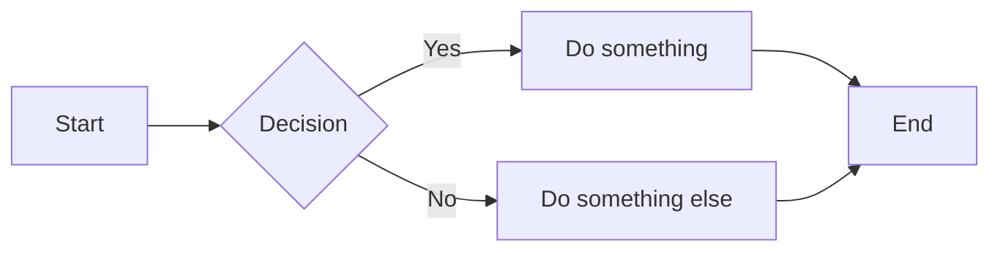

# Marmite Markdown Format Reference

Marmite accepts any valid CommonMark or GitHub Flavored Markdown (GFM) with additional extensions powered by the comrak parser. Raw HTML is allowed by default.

## Basic Formatting

```markdown
**bold**
*italic*
__underline__
~~strikethrough~~
||spoiler text||
```

## Headings

```markdown
# Heading 1
## Heading 2
### Heading 3
#### Heading 4
##### Heading 5
###### Heading 6
```

The first `# Heading` in a file is used as the title if no `title` frontmatter field is set.

## Links

### Regular Links

```markdown
[Link text](https://example.com)
[Link with tooltip](https://example.com "Tooltip text")
```

### Auto-links

URLs are automatically linked:

```markdown
https://example.com
<https://example.com>
<user@example.com>
```

### Reference Links

```markdown
[Link text][ref-id]

[ref-id]: https://example.com "Optional title"
```

Use `_references.md` for references shared across all content files.

### Wikilinks

Link to other pages using wiki-style syntax:

```markdown
[[page-slug]]
[[page-slug.md]]
[[page-slug.html]]
[[Display Text|page-slug]]
[[Page Title#section-anchor]]
[[#local-anchor]]
[[https://external-url.com]]
```

Wikilinks resolve to other posts and pages by slug. Anchors are supported.

The pipe direction is configurable:
- `wikilinks_title_before_pipe: true` (default) - `[[Display|slug]]`
- `wikilinks_title_after_pipe: true` - `[[slug|Display]]`

### Obsidian Links

Obsidian-style links (without display text):

```markdown
[[about]]
[[about.md]]
[[about#faq]]
[[Markdown Format]]          <!-- resolves by title -->
[[Markdown Format#section]]  <!-- title with anchor -->
```

### Backlinks

When you link to another page using any format (`[text](slug.html)`, `[[slug]]`, `[text](slug.md)`), marmite tracks the reference and displays a backlinks section on the linked page.

## Images

```markdown


```

Images are wrapped in `<figure>` tags with captions by default (`figure_with_caption: true`).

Place images in the `content/media/` folder (or the path configured by `media_path`).

## Lists

### Unordered

```markdown
- Item one
- Item two
  - Nested item
  - Another nested
- Item three
```

### Ordered

```markdown
1. First item
1. Second item
   1. Nested ordered
   1. Another nested
1. Third item
```

### Task Lists

```markdown
- [x] Completed task
- [ ] Incomplete task
- [x] Another done task
```

### Description Lists

```markdown
Term one
: Definition for term one

Term two
: First definition for term two
: Second definition for term two
```

## Block Quotes

### Standard

```markdown
> Single line quote

> Multi-paragraph quote
>
> Second paragraph of the quote
```

### Nested

```markdown
> Outer quote
> > Nested quote
> > > Deeply nested
```

### Multiline Block Quotes

```markdown
>>>
This is a multiline block quote.
It can span multiple lines without
the > prefix on each line.
>>>
```

## Code

### Inline

```markdown
Use `inline code` for short snippets.
```

### Fenced Code Blocks

````markdown
```python
def hello():
    print("Hello, world!")
```

```rust
fn main() {
    println!("Hello from Rust!");
}
```
````

Syntax highlighting is automatic when a language is specified. Configure themes:

```yaml
code_highlight:
  enabled: true
  light_theme: "github-light"
  dark_theme: "github-dark"
```

## Tables

```markdown
| Column 1 | Column 2 | Column 3 |
|----------|----------|----------|
| Cell 1   | Cell 2   | Cell 3   |
| Cell 4   | Cell 5   | Cell 6   |
```

Alignment:

```markdown
| Left     | Center   | Right    |
|:---------|:--------:|---------:|
| left     | center   | right    |
```

## Footnotes

```markdown
Here is a statement with a footnote[^1].

Another claim needing a source[^note].

[^1]: This is the footnote content.
[^note]: Named footnotes work too.
```

Footnote definitions must be separated from other content by a blank line. Global footnotes can be placed in `_references.md`.

## Alerts / Callouts

GFM-style alerts:

```markdown
> [!NOTE]
> Informational content the reader should know.

> [!TIP]
> Helpful advice for the reader.

> [!IMPORTANT]
> Critical information for success.

> [!WARNING]
> Content requiring immediate attention due to risks.

> [!CAUTION]
> Negative potential consequences of an action.
```

With custom title:

```markdown
> [!NOTE] Custom Title
> Content with a custom alert title.
```

## Spoilers

```markdown
The answer is ||42||.
```

Spoiler text is hidden until the reader clicks or hovers.

## Emoji

```markdown
:smile: :crab: :snake: :rocket:
```

Emoji shortcodes are converted to Unicode emoji.

## Math (KaTeX/MathJax)

Requires `extra.math: true` in frontmatter:

```yaml
---
extra:
  math: true
---
```

Inline math:
```markdown
When $a \ne 0$, the equation $ax^2 + bx + c = 0$ has solutions.
```

Display math:
```markdown
$$x = {-b \pm \sqrt{b^2-4ac} \over 2a}$$
```

Block math:
```markdown
$$
\int_{-\infty}^{\infty} e^{-x^2} dx = \sqrt{\pi}
$$
```

## Mermaid Diagrams

Requires `extra.mermaid: true` in frontmatter:

```yaml
---
extra:
  mermaid: true
  mermaid_theme: default   # options: default, dark, forest, neutral, base
---
```

````markdown

````

Supported diagram types: flowcharts, sequence diagrams, class diagrams, state diagrams, ER diagrams, Gantt charts, pie charts, timelines, xy charts, and more.

## Raw HTML

All raw HTML is allowed by default (`unsafe: true` in parser options):

```markdown
<div class="custom-box">
  <p>Custom HTML content</p>
</div>

<details>
<summary>Click to expand</summary>

Hidden content here. **Markdown works inside HTML blocks** if there is a blank line
after the opening tag.

</details>
```

### HTML Entities

```markdown
&copy; &reg; &trade; &euro; &larr; &rarr; &uarr; &darr;
```

### Superscript/Subscript

```markdown
80<sup>2</sup>
H<sub>2</sub>O
```

## Horizontal Rules

```markdown
---
***
___
```

## Greentext

When enabled (`greentext: true`, default: false):

```markdown
>implying something
>this line is green
```

## Parser Configuration

All markdown extensions can be toggled in `marmite.yaml`:

```yaml
markdown_parser:
  render:
    unsafe: true                      # Allow raw HTML (default: true)
    ignore_empty_links: true          # Ignore empty references (default: true)
    figure_with_caption: true         # Wrap images in <figure> (default: true)
  parse:
    relaxed_tasklist_matching: true    # Relaxed task list syntax (default: true)
  extension:
    strikethrough: true               # ~~text~~ (default: true)
    table: true                       # Tables (default: true)
    autolink: true                    # Auto-detect URLs (default: true)
    tasklist: true                    # Task list checkboxes (default: true)
    footnotes: true                   # Footnotes (default: true)
    description_lists: true           # Term : definition (default: true)
    multiline_block_quotes: true      # >>> blocks (default: true)
    underline: true                   # __underline__ (default: true)
    spoiler: true                     # ||spoiler|| (default: true)
    greentext: false                  # >greentext (default: false)
    shortcodes: true                  # Shortcode processing (default: true)
    wikilinks_title_before_pipe: true # [[Title|slug]] (default: true)
    wikilinks_title_after_pipe: false # [[slug|Title]] (default: false)
    alerts: true                      # > [!NOTE] alerts (default: true)
    tagfilter: false                  # Filter dangerous HTML tags (default: false)
```
