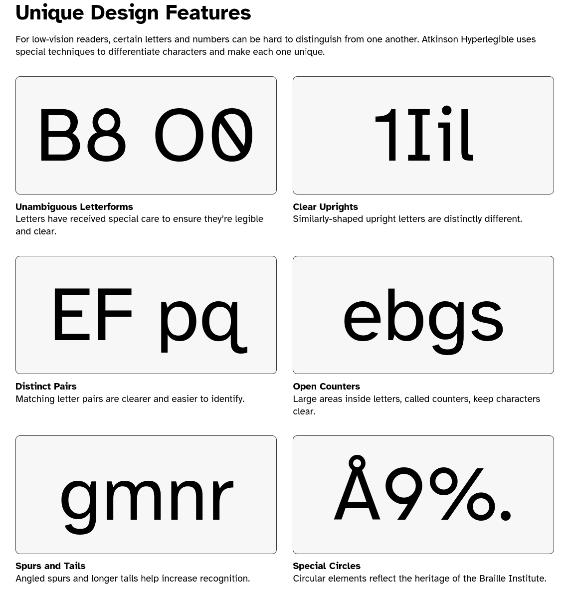

**Marmite** is a simple, easy and **opinionated** static site generator.

----

**Marmite** doesn't require specific folder structure or complex configuration,
the goal is that a **blog** can be generated simply by running Marmite on a folder with Markdown and media files.

**Marmite** is optimized for blogs, not only the content parsing and organization features but also the built-in theme is optimized for blogging and readability.

**Marmite** can also be used to create other kinds of sites as it is fully configurable and very easy to customize the templates.

**Marmite** comes with a built-n theme that is very flexible, optimized for readability and with 11 colorschemes to switch.

**Marmite** generated RSS and JSON feeds for all the listings in your site,
so you get feeds for main index, tags, authors and custom streams.

**Marmite** aims to be easier to integrate with the social web, by adopting semantic
federation standards and integrating with the fediverse.

**Marmite** is written in **Rust** so it is very fast and everything is included
in a single binary.

----

To generate your static site the only thing you need is a folder with some
markdown files and `marmite`.

assuming you have a folder called `mycontent` containing files with `.md` extension:

```plain
mycontent/
  |_ about.md
  |_ first-post.md
  |_ something-amazing-that-i-want-to-share.md
```

```console
$ marmite mycontent mysite -v
Site generated at: /mysite
```

That is all you need to have a blog generated, now you just need to take the 
`mysite` folder and publish it in a webserver, read more on [hosting](./hosting.html).


Learn how to create your first blog with marmite on our [Getting Started Tutorial](getting-started.html)

---

## Marmite Opinions

### Built-in Theme

Marmite built-in theme has a very simple structure, it is not bloated with elements so it makes it easier to customize for your needs using only CSS variables.

The main goal is that you can start publishing your texts using the built-in theme and gradually customize the look and feel for your taste, without the need to spend too much time on it, focusing on writing.

But if you want, as the templates are simple it is also straightforward to fully customize or start from scratch.

#### Content Card Width

Baymard Institute conducted a [research for optimal line lenght](https://baymard.com/blog/line-length-readability), considering Marmite is optimized for blogs the built-in theme adopts by default the maximum of `74ch` width.


#### Readable Font

The font face choosen for the built-in theme also was taken because of readability, the Braile Institute created a freefont with unique features to
improve readability in any media, that is why Marmite uses [Atkinson Hyperlegible](https://www.brailleinstitute.org/freefont/) by default.



#### Design System

##### Style

The built-in theme uses [picocss](https://picocss.com) a very small and simple to use CSS library, Pico makes use of CSS variables so it is very straightforward to customize the theme, placing a `custom.css` in your content folder and dealing with PicoCSS variables.

Example:

`mycontent/custom.css`
```css
:root {
  --pico-color: blue;  /* change text color */
  --pico-background-color: #FFCC00; /* change background color */
  --pico-card-background-color: #ccc; /* change background color of articles */
  --pico-container-max-width: 100ch;  /* line Lenght Increase to 100 chars */
  --pico-font-family: "Helvetica", sans-serif;  /* Different font */
  --pico-border-radius: 4px; /* cards border radius */
  --pico-typography-spacing-vertical: 1rem; /* line spacing */
}
```

The CSS looks like a config file, easy to use, and you can also be creative and add more CSS styling than just variables.

##### Scripting

**Marmite** is very lightweight on JavaScript, it can also be configured to be
javascript-less.

The built-in theme uses Javascript only to:

- Toggle dark/light modes

And on content, optionally enabled on content metadata.

- Render mermaid diagrams
- Render Math syntax

Optional features

- Search
  - When enabled, it will use fuse.js 
- Comments
  - When enabled it will use a JS script to load comment box

----

#### Information Architecture

The built-in theme is heavily optimized for blogging, so the main content of the
articles are the most important part, besides that some other decisions were made with the blog reader in mind.

- Fully responsive
- Listing pages highlights content title, description, date and tags
- Estimated reading time is calculated based on average wpm
- No distractions, No side panels, only listing and main content
- Content groups for tags, dates and author
- Author profile page
- Global references can be defined on `_references.md` and linked on any content.
- A custom header and footer can be injected to all pages for global  callouts and alerts.

----

#### Colorschemes

Marmite comes with some colorschemes built-in, colorschemes are CSS style files that customizes colors, spacing etc.

if you use other applications such
as text editors, terminals and web apps you probably are familiarized with the colorschemes available.

To choose a colorscheme add to config

`marmite.yaml`
```yaml
extra:
  colorscheme: gruvbox
```

The built-in options are **catppuccin**, **clean**, **dracula**, **github**, **gruvbox**, **iceberg**, **monokai**, **nord**, **one**, **solarized**, **typewriter**.

Click to select a colorscheme: <select name="colorscheme" class="colorscheme-toggle"><option value="default">default</option></select><span class="theme-toggle secondary" title="dark mode">&#9789;</span>

To create a custom colorscheme drop a `custom.css` on your input folder (the same where marmite.yaml is located)

<details>

<summary> CLICK HERE to see an example colorscheme on <code>custom.css</code> </summary>


`custom.css`
```css
/* Marmite Nord Theme */
/* picocss.com  */
:root {
    --pico-border-radius: 0;
}

.content-tags a:where(a:not([role=button])),
[role=link] {
    --pico-color: revert;
}

[data-theme=light],
:root:not([data-theme=dark]) {
    --pico-background-color: #ECEFF4;
    --pico-card-background-color: #E5E9F0;
    --pico-card-sectioning-background-color: var(--pico-background-color);
    --pico-primary: #5E81AC;
    --pico-primary-hover: #81A1C1;
    --pico-color: #2E3440;
    --pico-tag: #4C566A;
    --pico-h1-color: var(--pico-primary);
    --pico-code-background-color: var(--pico-background-color);
    --pico-table-border-color: var(--pico-card-background-color);
    --pico-color-azure-550: var(--pico-primary);
}

[data-theme=light] pre:has(> code.language-mermaid) {
    background-color: var(--pico-card-background-color);
}

[data-theme=dark],
:root:not([data-theme=light]) {
    --pico-background-color: #2E3440;
    --pico-card-background-color: #3B4252;
    --pico-card-sectioning-background-color: var(--pico-background-color);
    --pico-primary: #81A1C1;
    --pico-primary-hover: #88C0D0;
    --pico-color: #D8DEE9;
    --pico-tag: #4C566A;
    --pico-h1-color: var(--pico-color);
    --pico-code-background-color: var(--pico-background-color);
    --pico-table-border-color: var(--pico-card-background-color);
    --pico-color-azure-550: var(--pico-primary);
}

[data-theme=dark] pre:has(> code.language-mermaid) {
    background-color: var(--pico-code-color);
}
```

> [!NOTE]  
> Multiple colorschemes can also be added to `static/colorschemes/{name}.css`
> and then enable `extra.colorscheme_toggle` on config.

</details>
<hr>

#### Custom Themes

A theme on marmite is based on `static` and `templates` folder, you
can just start from scratch and create your own theme (please share with us if you do).

Marmite CLI also comes with a `--start-theme` command that will take the built-in theme and copy to your folder, so you can fully customize the templates and static files, read more on [customizing templates](./customizing-templates.html).

---

## Content Types

**Marmite** does not complicate in terms of content types and taxonomies, there are only 2 types of content `Post` and `Page`, and only 2 types of taxonomy `Tags` and `Stream`.

You can read more in details on [[content-types]]

---

## Generated Site

The site generated by **Marmite** is a flat HTML site, it means that even if the input folder has content organized in subfolder for better writting experience,
the **final** website will always be **flat**.

What is a flat site?

- There are no subfolders, every page is served from `/{slug}.ext`
- There are extensions, content will have `.html` and feeds will have `.rss|.json`

Why this was decided?

Flat sites makes it easier to:

- Cross link pages and media
- Open the site directly in the browser without the need for a server
- Customize the templates
- Extend functionalities

This is a **opinion** that some people don't like, because it is common to use what 
people call ~pretty URLs~, e.g: `/page` instead of `/page.html` however Marmite opinion
is that `.html` does't make the URL ugly, HTML is an amazing technology and there is 
no problem on showing that our content is published on a static HTML site.

Semantically it is better to have the extension because it is easier to distinguish a folder or an API endpoint from the final content.

If for some reason you don't like the URLs you can still customize it via your webserver, you can configure NGINX for example to do a transparent rewrite of URLS to serve `.html` content, but is directly supported by Marmite.

