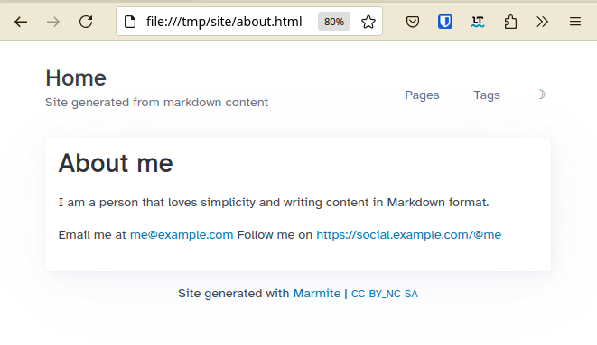
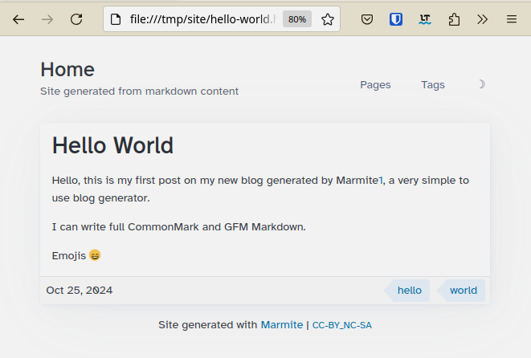
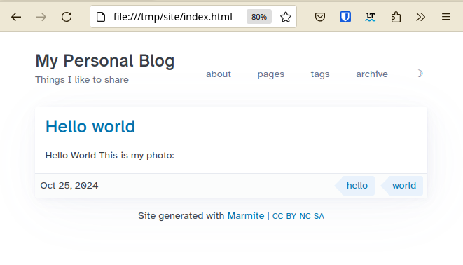
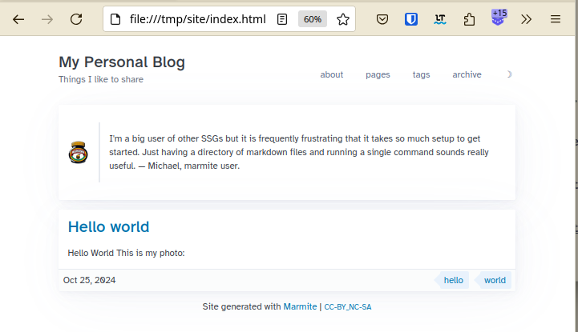
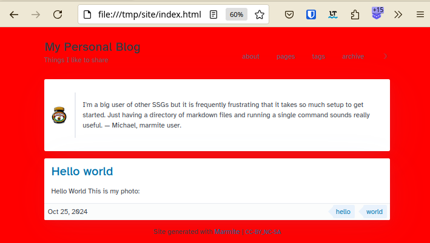

Learn how to create your blog with Marmite in minutes, you can start with zero-config  and then customize gradually later.

Not convinced yet? Read [[why-to-use-marmite]]

## Quick Start

### Installation

Marmite is written in Rust :crab: so if you have Rust in your system you 
can use cargo to install it.

```bash
cargo binstall marmite
```
or

```bash
cargo install marmite
```

Or download the pre-built **binary** from the [releases](https://github.com/rochacbruno/marmite/releases)


<details>

<summary>Or use docker</summary>


> [!IMPORTANT]
> The directory containing your marmite project must be mapped to containers `/input`  
> If running inside the directory use `$PWD:/input` 
> The result will be generates in a `site` folder inside the input dir.

Build
```console
$ docker run -v $PWD:/input ghcr.io/rochacbruno/marmite
Site generated at: site/
```
Serve (just add port mapping and the --serve)
```console
$ docker run -p 8000:8000 -v $PWD:/input ghcr.io/rochacbruno/marmite --serve
```

</details>

<details>

<summary>Or install from the package manager</summary>

**Homebrew (macOS/Linux)**
```console
brew install marmite
```
[View formula](https://formulae.brew.sh/formula/marmite)

**Arch Linux (AUR)**
```console
yay -S marmite-bin
```
[View package](https://aur.archlinux.org/packages/marmite-bin)

**FreeBSD**
```console
pkg install marmite
```
[View port](https://www.freshports.org/www/marmite/)

</details>


### Starting your site project

For a simple website marmite doesn't require any specific directory structure,
you just need a directory containing markdown files.

So start by creating a new directory for your content.

```bash
mkdir myblog
```

### Adding content


On this example lets add an **about** page:

`myblog/about.md`
```markdown
# About me

I am a person that loves simplicity and writing content in 
Markdown format.

Email me at <me@example.com>
Follow me on <https://social.example.com/@me>
```

And a **hello world** post:

`myblog/hello-world.md`
```markdown
---
date: 2024-10-25
tags: hello,world
---
# Hello World

Hello, this is my first post on my new blog generated
by Marmite[1], a very simple to use blog generator.

I can write full CommonMark and GFM Markdown.

Emojis :smile:

[1]: https://github.com/rochacbruno/marmite
```

The main difference from those 2 files is the fact that the first one **about.md**
doesn't have a `date:` metadata and since marmite can't detect its date, it considers
it a **page**. 

The second, **hello-world.md** has a `date: ...` on its **FrontMatter** so
marmite considers it a **chronological** content, a **post** and will list it 
on your blog front-page.

Learn more about [[Content Types|content-types]]


### Using the CLI

**Alternatively** you can ask marmite to create the initial structute and config for you.

```console
$ marmite myblog --init-site \
  --name Mysite \
  --tagline "My Articles and Notes" \
  --colorscheme nord \
  --toc true \
  --enable-search true
```

And content using

```console
$ marmite myblog --new "This is my new post title" -t "post,notes" -e
```


### Generating the site

>>>
I'm a big user of other SSGs but it is frequently frustrating that it takes so much setup to get started.  
Just having a directory of markdown files and running a single command sounds really useful.  
&mdash; Michael, marmite user.
>>>

As said above, you just need to run marmite and point your content directory,
the usage is `marmite [input_folder] [output_folder] [options]`

So do:

```console
$ marmite myblog site -v

INFO Config loaded from: defaults
INFO Generated site/index.html
INFO Generated site/pages.html
INFO Generated site/hello-world.html
INFO Generated site/about.html
INFO Generated site/404.html
INFO Generated site/tag-hello.html
INFO Generated site/tag-world.html
INFO Generated site/tags.html
INFO Generated site/static/*{css,js,fonts}
INFO Generated site/index.rss
INFO Generated site/{tag-*}.rss
INFO Generated site/{author-*}.rss
INFO Site generated at: site/
```

> [!TIP]
> You can omit the INFO messaged by omiting the `-v` or increase by adding up to 4 `-vvvv`

And that's all! you have full working blog on the `site` folder, as **marmite**
generates a **flat html** website, you can open directly in your browser.

To see your site you can open the `index.html` in your browser, type `Ctrl + O`
on your keyboard and your browser will let you navigate to the folder and then
select the `index.html` file.


<figure>
  <figcaption>Ctrl + O</figcaption>
  
</figure>


Then your site will look like:

<figure>
  <figcaption>Home Page</figcaption>
  
</figure>

<figure>
  <figcaption>About Page</figcaption>
  
</figure>

<figure>
  <figcaption>Post Light Mode</figcaption>
  
</figure>

<figure>
  <figcaption>Post Dark Mode</figcaption>
  
</figure>

<figure>
  <figcaption>Tags</figcaption>
  
</figure>

### Automatic re-generation when files changes

Instead of manually executing the command every time you change your
markdown files you can tell marmite to detect the changes and regenerate.

```
marmite myblog site --watch
...
Watching for changes in folder: myblog
```

### Serving the site

Marmite comes with a built-in server, this server is not meant to use in
production, when publishing your site you are probably going to use a
webserver such as **Apache** or **Nginx**, or most probably use a free
static hosting service such as **Github pages**, **Netlify** or **CLoudflare**.

However, during the content writing you want to check how the website looks,
so the built-in server comes handy, just add `--serve`

```
marmite myblog site --watch --serve
...
Watching for changes in folder: myblog
Starting built-in HTTP server
Server started at http://localhost:8000/ - Type ^C to stop.
```

Open your browser and check http://localhost:8000/ to see your running blog

if you want to share your site with others in the same network, just 
pass `--bind "0.0.0.0:8000` and then share your local IP address.

## Media

You gonna want some nice images in your blog posts, it is easy and simple 
to add it with marmite.

Create your `myblog/media` folder and include any image or video you want inside it
then in your markdown content just reference using the relative path.

`myblog/hello-world.md`
```markdown
---
date: 2024-10-25
tags: hello,world
---
# Hello World

This is my photo:

```

<figure>
  <figcaption>Media</figcaption>
  
</figure>

> [!NOTE]  
> You **can create** subfolders in the media directory, that is useful to organize
> files by topic or post.

## Organizing content

For now all your markdown files are located on `myblog/` root folder,
that is enough if you are going to stick with the defaults, but as soon you
start customizing templates and configuration you gonna need to organize your 
contents.

**marmite** generated a **flat html** site, that means you can't have subpaths,
your content will always be served from the top level.

But for better organization of your project **YOU CAN OPTIONALLY** move all your **markdown**
files to a subfolder called `content/`

```bash
myblog/
   |_ content/
         |_ about.md
         |_ hello-world.md
         |_ media/
             |_ myphoto.png
```

## Configuring

marmite is designed to be **zero** config to get started, just like you
did above!

But you probably want to customize couple of things in your website to give 
your personal touch, change the look and feel, or even completely customize
its front-end if you know some **CSS/JS** magic.

### Adding your blog information

If found, marmite will load configuration from a file named `marmite.yaml`
located in the root of your input_folder, in this case:

`myblog/marmite.yaml`
```yaml
name: My Personal Blog
tagline: Things I like to share
pagination: 10
menu:
  - ["about", "about.html"]
  - ["pages", "pages.html"]
  - ["tags", "tags.html"]
  - ["archive", "archive.html"]
```

Now regenerate your site with 
```
marmite myblog site --watch --serve
```
And refresh your browser to take a look at the customizations.

<figure>
  <figcaption>Config</figcaption>
  
</figure>


You can see all available options on the Marmite [example config]

You can generate a config file with the default values for editing:

```console
$ marmite myblog site --generate-config
Config generated at `myblog/marmite.yaml`
```

#### Configuring via CLI

You can also pass configuration variables directly to the CLI when building

```console
$ marmite myblog site \
  --name MySite \
  --tagline "My articles and notes" \
  --url "https://myblog.com" \
  --pagination 20 \
  --toc true \
  --enable-search true \
  --colorscheme dracula \
  --language en \
  --footer "- <strong>CopyLeft</strong> -"
```

### Enabling Comments

Most of blogs will have a comment box to receive feedback from readers,
marmite doesn't come with one as it is a static site and doesn't have the 
ability to handle dynamic data, instead, marmite allows you to plug external
commenting system providers such as **disqus** or **github**.

`myblog/_comments.md`
```yaml
##### Comments

<div id="#comment-box"></div>
<script> ... </script>
```

The content depends on which commenting system you choose and how it is configured.

Read more on [Enabling Comments] page to learn how to enable **Gisqus**, a
commenting system based on Github discussions.

## Disabling related content

To disable backlinks and related content for a post (via tags) you can use `--enable-related-content false` flag
in CLI or add the following to your `marmite.yaml`.

```yaml
enable_related_content: false
```


## Content Creation

Marmite handles two types of content:

- **Posts**: Content with dates (sorted by date, newest first)
- **Pages**: Static content without dates (sorted by title)

Dates can be specified in the filename (`YYYY-MM-DD-title.md`) or in frontmatter (`date: YYYY-MM-DD`).

### Creating New Content

Use the built-in content creation command:

```console
# Create a new post
$ marmite --new "My New Post"

# Create a new page
$ marmite --new "About Me" --page

# Create a post with tags
$ marmite --new "Tutorial: Getting Started" --tags "tutorial,beginner"

# Create and edit immediately
$ marmite --new "My Post" --edit
```

This creates properly formatted markdown files with frontmatter in your content directory.

### Content Organization

Organize content using **streams** (categories) and **tags**:

```yaml
---
title: "My Tutorial"
date: 2024-10-25
stream: tutorials
tags: beginner, guide
author: john
---
```

**Streams** group related content into separate feeds and navigation, while **tags** provide topical organization.

## Enabling Search

Marmite can generate static search index as a `JSON` file 
and then using Javascript library [Fuse] provide full text search for posts and pages.

To enable this feature add to your `marmite.yaml`

```yaml
enable_search: true
search_title: Search
```

## Special pages and Fragments

There are some contents that are considered **special** as those are 
not regular posts or pages, right now there are:

### Global fragments

The Global fragments are written in **dynamic** markdown format and allows raw html 
and also allows [Tera] expressions as those are rendered with global context.

<details>
<summary>Click here to see an example.</summary> 


**full markdown**
```html
##### tags


- [{{name}}](tag-{{name | slugify}}.html)
    
    - [{{item.title}}]({{item.slug}}.html)
    

```

**mixed html**
```html
# Hello

Markdown **here**

<!-- Mind the blank space between markdown and HTML blocks -->
<h3>Tags</h3>
<ul>

<li>
    <a href="tag-{{tag}}.html">{{tag}}</a>
    <ul>
        
        <li><a href="{{item.slug}}.html">{{item.title}}</li>
        
    </ul>
</li>  

</ul>
``` 

</details>

Hero - `_hero.md`

  : A banner that shows as the first content in your home page  
    Marmite will look for a file named `_hero.md` within your content folder.

404 - `_404.md`

  : The page that will show for Not Found error  
    Marmite will look for a file named `_404.md` within your content folder.  
    if not found, marmite will generate a default.


Footer - `_footer.md`

  : The content of `_footer.md` will be shown on the footer of base template
    this will override the contents of `marmite.yaml` `footer:` field 


Header - `_header.md`

  : The content of `_header.md` will be shown on the header of base template
    this will replace the Logo, Name, Tagline and menu entirely. 


Comments - `_comments.md`

  : The content of `_comments.md` will be rendered at the end of each post page,
    If exits this will have precedence over the `extra.comments` on `marmite.yaml`


Announce - `_announce.md`

  : The content of `_announce.md` will be rendered on the very top of the website, globally
    as a way to add alerts, annoucements and callouts.

### Content Fragments

The content fragments are **static** Markdown format and allows raw HTML.

> [!IMPORTANT]  
> [Tera] expressions are not rendered on these fragments because those are rendered
> before the global context is built.

References - `_references.md`

  : This file will be appended to the end of every markdown file
    processed, so it is possible to use the references and footnotes
    globally.
  **format**  
    ```markdown
    [name]: https://link
    ```

Markdown Footer - `_markdown_footer.md`

  : This file will be appended to the end of every markdown processed
    You can include anything inside it, this is useful to add custom
    callouts, messages, signatures to the end of contents.

Markdown Header - `_markdown_header.md`

  : This file will be prepended to the top of every markdown processed
    You can include anything inside it, this is useful to add custom
    callouts, messages, signatures to the end of contents.


<figure>
  <figcaption>Hero Section Enabled</figcaption>
  
</figure>


## Colorschemes

Marmite comes with some colorschemes built-in, colorschemes are CSS style files that customizes colors, spacing etc.

if you use other applications such
as text editors, terminals and web apps you probably are familiarized with the colorschemes available.

To choose a colorscheme add to `marmite.yaml`
```yaml
extra:
  colorscheme: gruvbox
```

The built-in options are **catppuccin**, **clean**, **dracula**, **github**, **gruvbox**, **iceberg**, **monokai**, **nord**, **one**, **solarized**, **typewriter**.

Click to select a colorscheme: <select name="colorscheme" class="colorscheme-toggle"><option value="default">default</option></select><span class="theme-toggle secondary" title="dark mode">&#9789;</span>

To create a custom colorscheme drop a `custom.css` on your input folder (the same where marmite.yaml is located)

<details>

<summary> CLICK HERE to see an example colorscheme on <code>custom.css</code> </summary>


`custom.css`
```css
/* Marmite Nord Theme */
/* picocss.com  */
:root {
    --pico-border-radius: 0;
}

.content-tags a:where(a:not([role=button])),
[role=link] {
    --pico-color: revert;
}

[data-theme=light],
:root:not([data-theme=dark]) {
    --pico-background-color: #ECEFF4;
    --pico-card-background-color: #E5E9F0;
    --pico-card-sectioning-background-color: var(--pico-background-color);
    --pico-primary: #5E81AC;
    --pico-primary-hover: #81A1C1;
    --pico-color: #2E3440;
    --pico-tag: #4C566A;
    --pico-h1-color: var(--pico-primary);
    --pico-code-background-color: var(--pico-background-color);
    --pico-table-border-color: var(--pico-card-background-color);
    --pico-color-azure-550: var(--pico-primary);
}

[data-theme=light] pre:has(> code.language-mermaid) {
    background-color: var(--pico-card-background-color);
}

[data-theme=dark],
:root:not([data-theme=light]) {
    --pico-background-color: #2E3440;
    --pico-card-background-color: #3B4252;
    --pico-card-sectioning-background-color: var(--pico-background-color);
    --pico-primary: #81A1C1;
    --pico-primary-hover: #88C0D0;
    --pico-color: #D8DEE9;
    --pico-tag: #4C566A;
    --pico-h1-color: var(--pico-color);
    --pico-code-background-color: var(--pico-background-color);
    --pico-table-border-color: var(--pico-card-background-color);
    --pico-color-azure-550: var(--pico-primary);
}

[data-theme=dark] pre:has(> code.language-mermaid) {
    background-color: var(--pico-code-color);
}
```

> [!NOTE]  
> Multiple colorschemes can also be added to `static/colorschemes/{name}.css`
> and then enable `extra.colorscheme_toggle` on config.

</details>
<hr>

## Layout Customization

If you want to keep using the default theme but wants to customize little parts
of its `CSS` and add additional `JS` then you can do it with the **easy mode**

### Easy mode

#### Custom CSS

Just create a new file `myblog/custom.css` and put any CSS you want inside it,
if you are customizing the default template take a look at [PicoCSS] docs.

Example:
`myblog/custom.css`
```css
body {
  background-color: red;
}
```

<figure>
  <figcaption>Custom CSS</figcaption>
  
</figure>

#### Customizing Content Width

The content container is optimized for blogs, if you want to change the 
width just add to the `custom.css`

```css
:root {
   --pico-container-max-width: 100ch;
}
```

#### Custom JS

The same as above, just create a `custom.js` and add any Javascript,
notice that the `custom.js` file is loaded at the bottom of the html files.

`myblog/custom.js`
```javascript
console.log("Hello from marmite");
```

### Advanced mode

Choose this option if your intention is to **fully** customize the default theme
or **start** a new theme from **scratch**.

#### Custom templates

To fully customize the templates you need a `templates` folder and add all the 
required templates as described on [Customizing Templates]

If you don't want to create the templates manually, you can dump the 
embedded templates in your project folder.

```bash
marmite myblog site --init-templates
```

The above command will create a `myblog/templates` folder with all the required
templates and you can freely customize.

The templates are written in [Tera].

#### Custom theme

Theme is generally the templates + Style, so in addition to custom templates
you need all the static files.

If you wrote your templates from **scratch** then you are free to refer
to any static file you want, create a folder named `static` and put any 
`css`, `js`, `fonts` etc inside it.

> [!IMPORTANT]
> marmite generates **flat html** website, all static file url
> will be relative like `./static/style.css` `./static/fonts/font.woof` etc.

If you don't want to create all static files by hand, but want to reuse the 
embedded theme, you can run.

```bash
marmite myblog --start-theme mytheme
```

The above command will create a `myblog/mytheme/` folder with complete theme files including templates, static assets, and documentation. Then you can freely customize the theme.

**Using the theme**:

Option 1 - Set in configuration:
```yaml
# marmite.yaml
theme: mytheme
```

Option 2 - Use CLI override:
```bash
marmite myblog output/ --theme mytheme
```

## Project structure

With contents and a custom theme your repository will look like:

**Modern structure (with themes)**:
```bash
myblog/
   |_ content/                     # Markdown content
   |     |_ _404.md
   |     |_ _hero.md
   |     |_ about.md
   |     |_ hello-world.md
   |     |_ media/                 # Images, Videos, PDFs
   |         |_ myphoto.png
   |_ mytheme/                     # Custom theme
   |     |_ templates/             # Tera HTML templates
   |     |     |_ *.html
   |     |_ static/                # Theme static files
   |     |     |_ *.{css,js,ttf,ico}
   |     |_ theme.json             # Theme metadata
   |     |_ theme.md              # Theme documentation
   |_ marmite.yaml                 # Config (theme: mytheme)
```

**Legacy structure (still supported)**:
```bash
myblog/
   |_ content/                     # Markdown content
   |_ templates/                   # Global templates
   |_ static/                      # Global static files
   |_ marmite.yaml                 # Config (no theme specified)
   |_ custom.css                   # Optional css
   |_ custom.js                    # Optional JS
```

## Looking for help

You can ask **Marmite** related questions or suggest features on [Discussions] page

> [!NOTE]  
> **We** would love to know if you publish a site  made with marmite or 
> created a custom theme, please share on the [Discussions] page.

---
