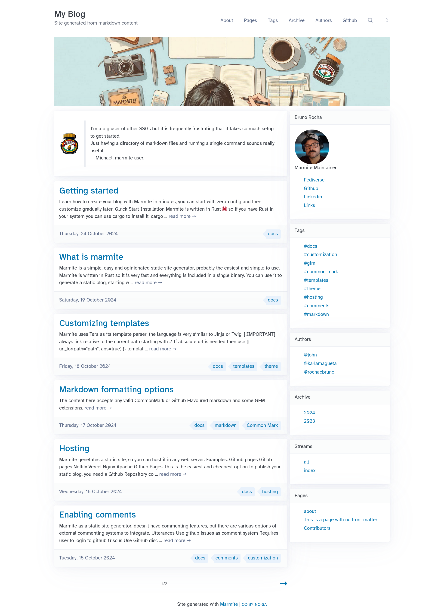

Marmite uses [Tera](https://keats.github.io/tera/docs/#templates) as its template
parser, the language is very similar to **Jinja** or **Twig**.

> [!IMPORTANT]  
> always link relative to the current path starting with `./`  
> If absolute url is needed then use `{{ url_for(path="path", abs=true) }}` template function.

Example on `templates/list.html`

```html


  <div class="content-list">
  
    <h2 class="content-title"><a href="./{{content.slug}}.html">{{ content.title | capitalize }}</a></h2>
    <p class="content-excerpt">{{ content.html | striptags | truncate(length=100, end="...") }}</p>
  
  </div>

```

## Starting a new theme

```console
$ marmite input_folder output_folder --start-theme
Generated input_folder/templates
Generated input_folder/static
```

Then you can start customizing those assets.

If instead, you just want to customize the templates use `--init-templates`
and the `custom.css` and `custom.js` in the root of the project.


## Templates

all templates are rendered with the global context.

```yaml
site_data:
  posts: [Content]
  pages: [Content]
  tag: GroupedContent
  archive: GroupedContent
  author: GroupedContent
  stream: GroupedContent
site:
  name: str
  url: str
  tagline: str
  pagination: int
  extra: {k, v}
  ...the keys on site configuration.
menu: [[name, link]]
```

The `Content` object can be a **page** or a **post** and contains

```yaml
title: str
slug: str
html: str
tags: [str] or []
date: DateTimeObject or None
extra: {key: value}
links_to: [str] or None
back_links: [Content] or []
card_image: str or None
banner_image: str or None
authors: [str] or []
pinned: bool
toc: str or None
next: Content or None
previous: Content or None
```

The `next` and `previous` attributes are available on the `content` object when rendering a single content page, and they hold the next and previous post objects, respectively. This is useful for creating navigation between posts.

Example of a next/previous navigation in `content.html`:

```html
<nav>
  <ul class="grid">
    <li><a href="./{{ content.previous.slug }}.html">← {{ content.previous.title }}</a></li>
    <li><a href="./{{ content.next.slug }}.html" style="text-align: right;">{{ content.next.title }} →</a></li>
  </ul>
</nav>
```

The `GroupedContent` is a map that when iterated returns a map of `name: [Content]`, this is available on global context,
which means `tag`, `archive` and `author` groups can be accessed on any template, however it is not recommended to access it directly,
because those are unordered, to get an ordered version use `group` function:

```html
<ul class="content-tags">
      <!-- kind can be one of [tag,archive,author] -->
        <li><a href="./tag-{{ name | trim | slugify }}.html">{{ name }}</a><span class="tag-count"> [{{ items | length }}]</span></li>
    
</ul>
```

There are 10 templates inside the `templates` folder, each adds more data to context.

- base.html
  - All other templates inherits blocks from this one.
- list.html
  - Renders `index.html`, `pages.html`, `tag-{name}.html`, `archive-{year}.html`, `author-{username}.html`
  - adds `title:str`, `content_list: [Content]`,
  - adds `author: Author` when rendering `author-*.html` pages. 
  - pagination: `current_page: str`, `next_page:str`, `previous_page:str`, 
    `total_pages:int`, `current_page_number:int`, `total_content:int`
- content.html
  - Renders individual content page `my-post.html`
  - adds `title:str`, `content: [Content]`, `current_page: str`
- group.html
  - Renders grouped information such as `tags.html` and `archive.html`
  - adds `title:str`, `current_page: str`, `kind:str`

Include templates:

Those are templates that are not meant to be rendered directly, those are included on other templates.

- pagination.html
  - Render the pagination controls
  - included on `list.html`
- comments.html
  - Render the comment box
  - included on `content.html`
- content_authors.html
  - Renders the small list of authors on botton of content
  - included on `content.html`
- content_date.html
  - Renders the article date
  - included on `content.html` and `content_title.html`
- content_title.html
  - Renders the main title of the content + date and reading time
  - included on `content.html`
- group_author_avatar.html
  - Renders the author avatar image
  - included on `group.html` (if author is defined)

When customizing the templates you can create new templates to use as `include` or `macro` but the 4 listed above are required.

If you just want to customize some individual template you can add only it in the
templates/ folder and the rest will be added by marmite.

See the templates on: [https://github.com/rochacbruno/marmite/tree/main/example/templates](https://github.com/rochacbruno/marmite/tree/main/example/templates)

## Customizing the index template

In the case you want to keep using the built-in theme but want to customize the index page of your site you can
just add a `templates/custom_index.html` to your input folder.

This template will be used for the index folder instead of the `list.html` and you can do whatever you want on it,
using the objets and functions available on the context.

Example of a custom index template.

<details>

<summary> <strong>Click Here</strong> to see the code for an example `templates/custom_index.html` </summary>


```html


    {# this head block is not needed if CSS is moved to custom.css #}
    {{ super() }}
    <style>
    .content-banner-image {
        background-size: cover;
        background-position: center;
        height: 300px;
        margin-bottom: 20px;
        background-image: url('media/og_image.jpg');
    }
    .main-div {
        display: flex;
        grid-column-gap: 10px;
        grid-row-gap: 0px;
    }
    .left {
        width: 70%;
    }
    .right {
        width: 30%;
    }
    .right li {
        list-style-type: none;
    }
    .author-card img {
        width: 150px;
        height: 150px;
        border-radius: 50%;
    }
    @media (max-width: 1024px) {
        .main-div {
            display: block;
        }
        .left {
            width: 100%;
        }
        .right {
            width: 100%;
        }
    }
    </style>



<div class="content-banner-image"></div>
<div class="main-div">
    <div class="left">
            
            <div class="hero">
                <article>
                    {{hero}}
                </article>
            </div>
            

            
            <article class="content-card">
                <h2 class="content-title"><a href="./{{content.slug}}.html">{{ content.title | capitalize }}</a></h2>
                <p class="content-excerpt">
                    
                    {{ content.description | replace(from='"', to="") | truncate(length=250, end=" ...") }}
                    
                    {{ content.html | striptags | trim_start_matches(pat=content.title) | truncate(length=250, end=" ...") }}
                    
                    <a class="secondary" href="./{{content.slug}}.html">read more &rarr;</a>
                </p>
                
                <footer class="data-tags-footer">
                    <span class="content-date"><a class="secondary" href="./{{content.slug}}.html">{{ content.date | default_date_format }}</a></span>
                    
                    <ul class="content-tags overflow-auto">
                        
                        <li><a href="./tag-{{ tag | trim | slugify }}.html">{{ tag }}</a></li>
                        
                    </ul>
                    
                </footer>
                
            </article>
            
            
                
            
        
    </div>
    <div class="right">
        
            
            <article class="author-card">
                <header>{{author.name}}</header>
                
                <p>{{author.bio}}</p>
                <ul>
                    
                    <li><a href="{{link.1}}">{{link.0}}</a></li>
                    
                </ul>
            </article>
             {# only show the first author #}
            
        
        <article>
            <header>Tags</header>
            <ul>
            
            <li><a href="tag-{{name | slugify}}.html">#{{name | slugify}}</a></li>
            
            </ul>
        </article>
        <article>
            <header>Authors</header>
            <ul>
            
            <li><a href="author-{{name | slugify}}.html">@{{name}}</a></li>
            
            </ul>
        </article>
        <article>
            <header>Archive</header>
            <ul>
            
            <li><a href="archive-{{year}}.html">{{year}}</a></li>
            
            </ul>
        </article>
        <article>
            <header>Streams</header>
            <ul>
            
            <li><a href="{{stream}}.html">{{stream}}</a></li>
            
            </ul>
        </article>
        <article>
            <header>Pages</header>
            <ul>
            
            <li><a href="{{page.slug}}.html">{{page.title}}</a></li>
            
            </ul>
        </article>
    </div>
</div> 

```

</details>

---

With the above HTML your index page will look like:

<figure>
  <figcaption>Custom Index</figcaption>
  
</figure>


> [!NOTE]  
> A custom index can be created for any **stream**, name the template `custom_{stream}.html`


## Static files

Just create a `static` folder side by side with your `templates` folder and add
all `css`, `js`, `fonts` etc on this folder.

Marmite will copy this folder to the output site, if this folder is not found
marmite will then copy the embedded static files to the static folder.

## URL 

Prefer to use relative paths for URLS, examples:

- `./my-blog-post.html`
- `./static/style.css`
- `./media/photo.png`

This is recommended because **marmite** will always generate a **flat** html website,
there is no subpaths.

If you need absolute url use the `url_for` function to refer to urls.

```html
{{ url_for(path='static/mystyle.css', abs=true) }}
```


## Extra data

On site config `marmite.yaml` there is an arbitrary field `extra` that can be accessed
on any template.

```yaml
extra:
  myname: Bruno
```
Then on an template.

```html
{{site.extra.myname}}
```

On each individual post there is a `extra` arbitrary field, so on `list.html` and
`content.html` this field can also be accessed.

```markdown
---
extra:
  image: media/banner.jpg
---
```
then on template
```html

```

## Raw HTML on markdown

Tera is configured to allow raw html on markdown, so any html tag will be 
allowed, a markdown file can include for example embeds, scripts, etc..

## Tera Object

Here the Tera object for reference, 
to see each individual filter or tester documentation read [https://keats.github.io/tera/docs/#templates](https://keats.github.io/tera/docs/#templates)

```rust 
Tera {
    templates: [
            group.html,
            base.html,
            list.html,
            content.html,
            pagination.html,
            comments.html,
    ]
    functions: [
            group,
            url_for,
    ]
    filters: [
            default_date_format,
            reverse,
            trim_start,
            trim,
            unique,
            float,
            trim_end,
            join,
            group_by,
            lower,
            trim_start_matches,
            wordcount,
            title,
            trim_end_matches,
            indent,
            filter,
            map,
            pluralize,
            upper,
            first,
            slice,
            last,
            round,
            length,
            date,
            filesizeformat,
            urlencode,
            urlencode_strict,
            nth,
            escape_xml,
            truncate,
            striptags,
            abs,
            linebreaksbr,
            spaceless,
            slugify,
            addslashes,
            capitalize,
            escape,
            split,
            int,
            concat,
            as_str,
            sort,
            replace,
            get,
            json_encode,
    ]
    testers: [
            number,
            object,
            ending_with,
            defined,
            odd,
            matching,
            even,
            containing,
            iterable,
            undefined,
            string,
            starting_with,
            divisibleby,
    ]
}
```