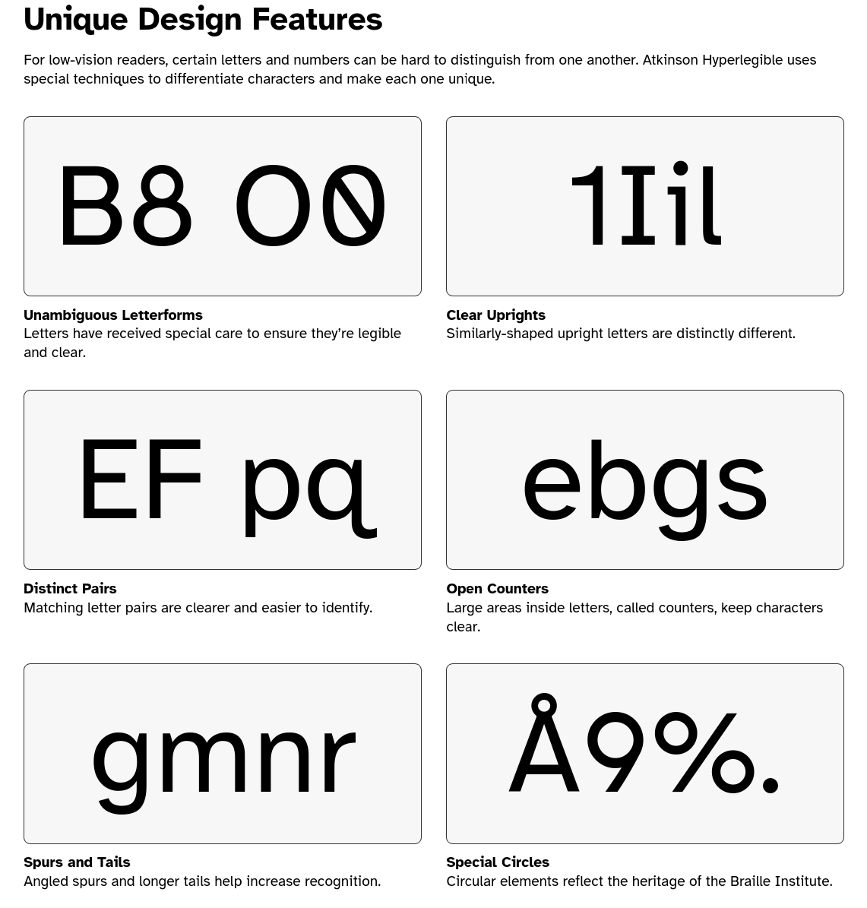

**Marmite** e um gerador de sites estaticos simples, facil e **opinativo**.

----

**Marmite** nao exige uma estrutura de pastas especifica ou configuracao complexa,
o objetivo e que um **blog** possa ser gerado simplesmente executando o Marmite em uma pasta com arquivos Markdown e midia.

**Marmite** e otimizado para blogs, nao apenas os recursos de parsing e organizacao de conteudo, mas tambem o tema integrado e otimizado para blogs e legibilidade.

**Marmite** tambem pode ser usado para criar outros tipos de sites, pois e totalmente configuravel e muito facil de personalizar os templates.

**Marmite** vem com um tema integrado que e muito flexivel, otimizado para legibilidade e com 11 esquemas de cores para alternar.

**Marmite** gera feeds RSS e JSON para todas as listagens do seu site,
entao voce recebe feeds para o indice principal, tags, autores e streams personalizados.

**Marmite** visa ser mais facil de integrar com a web social, adotando padroes semanticos de federacao e integrando com o fediverse.

**Marmite** e escrito em **Rust** entao e muito rapido e tudo esta incluido em um unico binario.

----

Para gerar seu site estatico a unica coisa que voce precisa e uma pasta com alguns
arquivos markdown e o `marmite`.

Supondo que voce tenha uma pasta chamada `meuconteudo` contendo arquivos com extensao `.md`:

```plain
meuconteudo/
  |_ sobre.md
  |_ primeiro-post.md
  |_ algo-incrivel-que-quero-compartilhar.md
```

```console
$ marmite meuconteudo meusite -v
Site generated at: /meusite
```

Isso e tudo que voce precisa para ter um blog gerado, agora basta pegar a
pasta `meusite` e publicar em um servidor web, leia mais em [hospedagem](./hosting.html).

Aprenda como criar seu primeiro blog com o marmite no nosso [Tutorial de Primeiros Passos](getting-started.html)

---

## Opinioes do Marmite

### Tema Integrado

O tema integrado do Marmite tem uma estrutura muito simples, nao e sobrecarregado com elementos, o que facilita a personalizacao para suas necessidades usando apenas variaveis CSS.

O objetivo principal e que voce possa comecar a publicar seus textos usando o tema integrado e gradualmente personalizar a aparencia ao seu gosto, sem precisar gastar muito tempo nisso, focando na escrita.

Mas se voce quiser, como os templates sao simples, tambem e direto personalizar completamente ou comecar do zero.

#### Largura do Card de Conteudo

O Baymard Institute conduziu uma [pesquisa sobre comprimento otimo de linha](https://baymard.com/blog/line-length-readability), considerando que o Marmite e otimizado para blogs, o tema integrado adota por padrao o maximo de `74ch` de largura.


#### Fonte Legivel

A fonte escolhida para o tema integrado tambem foi selecionada pela legibilidade, o Braille Institute criou uma fonte gratuita com recursos unicos para melhorar a legibilidade em qualquer midia, por isso o Marmite usa [Atkinson Hyperlegible Next](https://www.brailleinstitute.org/freefont/) por padrao.



#### Sistema de Design

##### Estilo

O tema integrado usa [picocss](https://picocss.com), uma biblioteca CSS muito pequena e simples de usar. O Pico utiliza variaveis CSS, entao e muito direto personalizar o tema, colocando um `custom.css` na sua pasta de conteudo e lidando com as variaveis do PicoCSS.

Exemplo:

`meuconteudo/custom.css`
```css
:root {
  --pico-color: blue;  /* mudar cor do texto */
  --pico-background-color: #FFCC00; /* mudar cor de fundo */
  --pico-card-background-color: #ccc; /* mudar cor de fundo dos artigos */
  --pico-container-max-width: 100ch;  /* comprimento de linha aumentado para 100 chars */
  --pico-font-family: "Helvetica", sans-serif;  /* fonte diferente */
  --pico-border-radius: 4px; /* raio da borda dos cards */
  --pico-typography-spacing-vertical: 1rem; /* espacamento de linha */
}
```

O CSS parece um arquivo de configuracao, facil de usar, e voce tambem pode ser criativo e adicionar mais estilo CSS alem de apenas variaveis.

##### Scripts

**Marmite** e muito leve em JavaScript, tambem pode ser configurado para funcionar sem JavaScript.

O tema integrado usa Javascript apenas para:

- Alternar modos escuro/claro

E no conteudo, opcionalmente habilitado nos metadados do conteudo.

- Renderizar diagramas mermaid
- Renderizar sintaxe Math

Recursos opcionais

- Busca
  - Quando habilitada, usara fuse.js
- Comentarios
  - Quando habilitados, usara um script JS para carregar a caixa de comentarios

----

#### Arquitetura da Informacao

O tema integrado e fortemente otimizado para blogs, entao o conteudo principal dos artigos e a parte mais importante, alem disso outras decisoes foram tomadas com o leitor do blog em mente.

- Totalmente responsivo
- Paginas de listagem destacam titulo, descricao, data e tags do conteudo
- Tempo estimado de leitura calculado baseado na media de palavras por minuto
- Sem distracoes, sem paineis laterais, apenas listagem e conteudo principal
- Grupos de conteudo por tags, datas e autor
- Pagina de perfil do autor
- Referencias globais podem ser definidas em `_references.md` e vinculadas em qualquer conteudo
- Um cabecalho e rodape personalizados podem ser injetados em todas as paginas para alertas globais

----

#### Esquemas de Cores

O Marmite vem com alguns esquemas de cores integrados, esquemas de cores sao arquivos de estilo CSS que personalizam cores, espacamento etc.

Se voce usa outros aplicativos como editores de texto, terminais e apps web, provavelmente esta familiarizado com os esquemas de cores disponiveis.

Para escolher um esquema de cores adicione na configuracao

`marmite.yaml`
```yaml
extra:
  colorscheme: gruvbox
```

As opcoes integradas sao **catppuccin**, **clean**, **dracula**, **github**, **gruvbox**, **iceberg**, **monokai**, **nord**, **one**, **solarized**, **typewriter**.

Para criar um esquema de cores personalizado, coloque um `custom.css` na sua pasta de entrada (a mesma onde o marmite.yaml esta localizado)

---

#### Temas Personalizados

Um tema no marmite e baseado nas pastas `static` e `templates`, voce pode simplesmente comecar do zero e criar seu proprio tema (por favor compartilhe conosco se fizer).

O CLI do Marmite tambem vem com um comando `--start-theme` que ira pegar o tema integrado e copiar para sua pasta, para que voce possa personalizar completamente os templates e arquivos estaticos, leia mais em [personalizando templates](./customizing-templates.html).

---

## Tipos de Conteudo

**Marmite** nao complica em termos de tipos de conteudo e taxonomias, existem apenas 2 tipos de conteudo `Post` e `Page`, e apenas 2 tipos de taxonomia `Tags` e `Stream`.

Voce pode ler mais em detalhes em [[content-types]]

---

## Site Gerado

O site gerado pelo **Marmite** e um site HTML plano, isso significa que mesmo se a pasta de entrada tiver conteudo organizado em subpastas para melhor experiencia de escrita, o site **final** sera sempre **plano**.

O que e um site plano?

- Nao ha subpastas, cada pagina e servida a partir de `/{slug}.ext`
- Ha extensoes, conteudo tera `.html` e feeds terao `.rss|.json`

Por que isso foi decidido?

Sites planos facilitam:

- Vincular paginas e midia entre si
- Abrir o site diretamente no navegador sem necessidade de servidor
- Personalizar os templates
- Estender funcionalidades

Esta e uma **opiniao** que algumas pessoas nao gostam, porque e comum usar o que as pessoas chamam de ~URLs bonitas~, por exemplo: `/pagina` em vez de `/pagina.html`, porem a opiniao do Marmite e que `.html` nao torna a URL feia, HTML e uma tecnologia incrivel e nao ha problema em mostrar que nosso conteudo e publicado em um site HTML estatico.

Semanticamente e melhor ter a extensao porque e mais facil distinguir uma pasta ou um endpoint de API do conteudo final.

Se por algum motivo voce nao gostar das URLs, ainda pode personalizar via seu servidor web, voce pode configurar o NGINX por exemplo para fazer uma reescrita transparente de URLs para servir conteudo `.html`, mas isso nao e diretamente suportado pelo Marmite.
