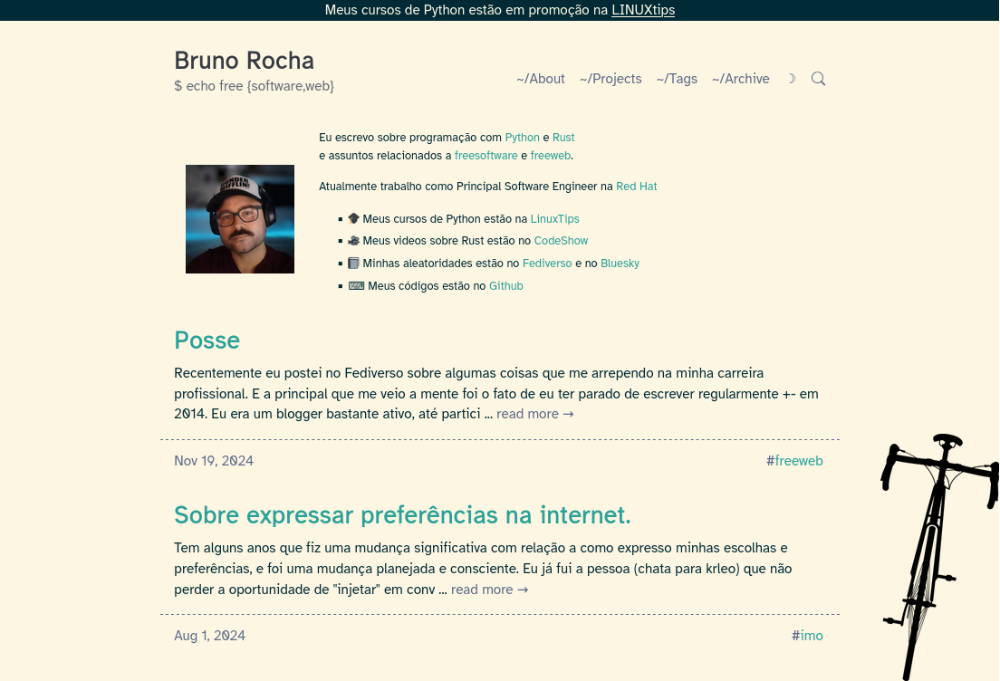
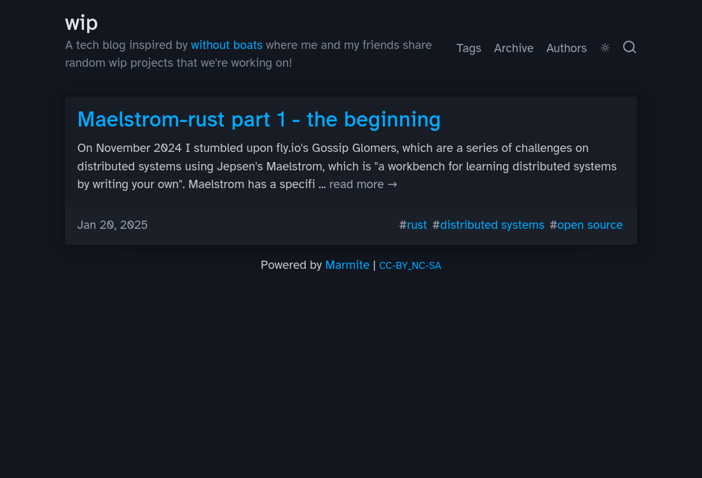
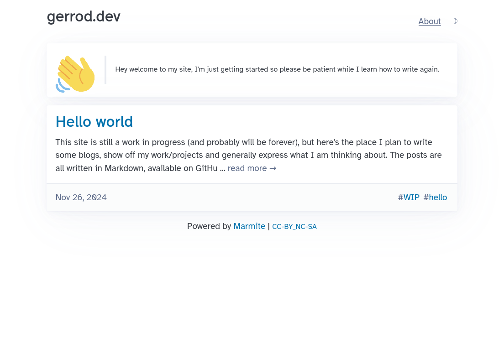
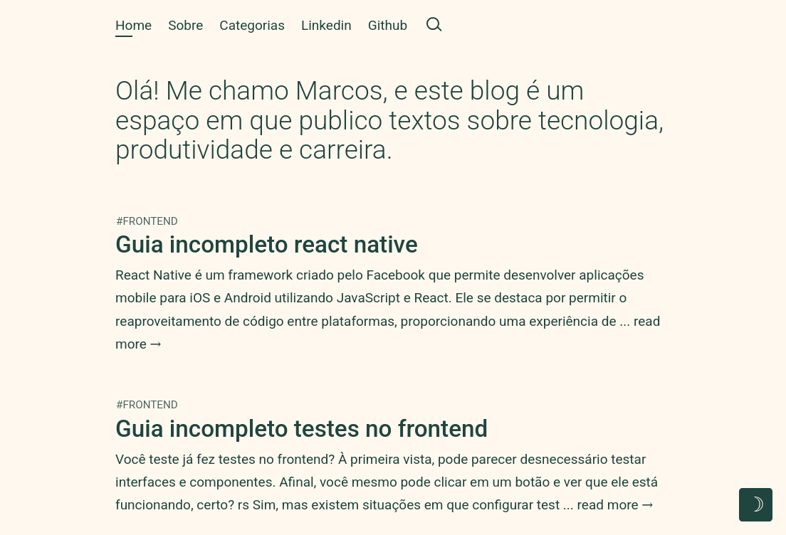

# Showcase

### Sites and Blogs Powered by Marmite

<!-- 

List of sites powered by Marmite

Title, link, image
Bruno Rocha, https://rochacbruno.com, rochacbruno.com.png
Gabriel Saiago - Developer, https://grsaiago.github.io/wipblog, grsaiago.github.io__wipblog.png
Gerrod - Software Engineer, https://gerrod.com, gerrod.dev.png
Marcos Oliveira - Front-end Developer, https://blog.bymarcos.com, blog.bymarcos.com.png
Racoonland, https://racoonland.us, racoonland.us.png
Viana Tech, https://vianatech.pt, vianatech.pt.png
 -->

<article>
<h4>Bruno Rocha - Software Engineer</h4>
<a class="card" href="https://rochacbruno.com" target="_blank" title="Bruno Rocha">
    
</a>
</article>

<article>
<h4>Gabriel Saiago - Developer</h4>
<a class="card" href="https://grsaiago.github.io/wipblog" target="_blank" title="Gabriel Saiago">
    
</a>
</article>

<article>
<h4>Gerrod - Software Engineer</h4>
<a class="card" href="https://gerrod.com" target="_blank" title="Gerrod">
    
</a>
</article>

<article>
<h4>Marcos Oliveira - Front-end Developer</h4>
<a class="card" href="https://blog.bymarcos.com" target="_blank" title="Marcos Oliveira">
    
</a>
</article>

<article>
<h4>Raccoonland</h4>
<a class="card" href="https://raccoonland.us" target="_blank" title="raccoonland">
    
</a>
</article>

<article>
<h4>Viana Tech</h4>
<a class="card" href="https://vianatech.pt" target="_blank" title="Viana Tech">
    
</a>
</article>

---

### Add your site

If you are using Marmite and want to add your site to the showcase, please open a PR with the following information:

- Title
- Link
- Image (300x200)

Add the image to the `media/showcase` folder and update the list above, following the same pattern.

```html
<article>
<h4>Name</h4>
<a class="card" href="https://link.tld" target="_blank" title="Name">
    
</a>
</article>
```