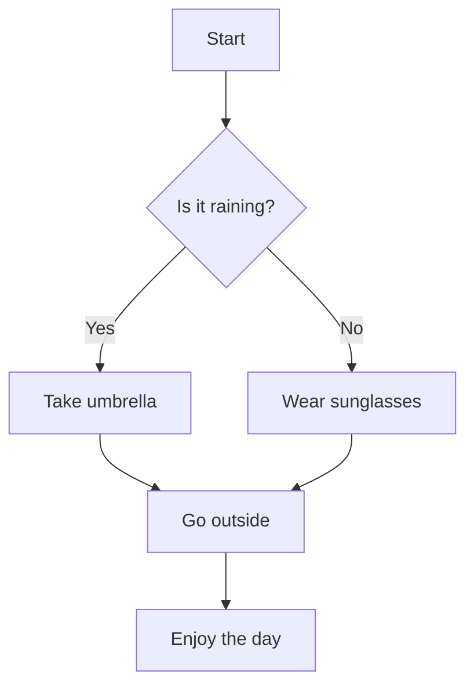
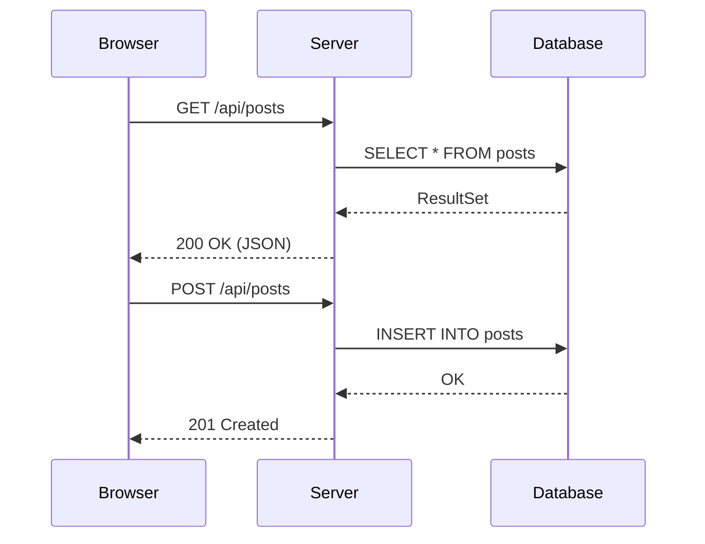
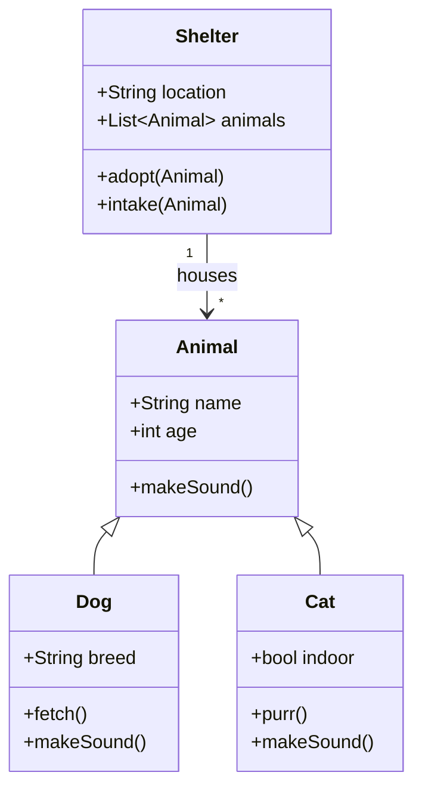
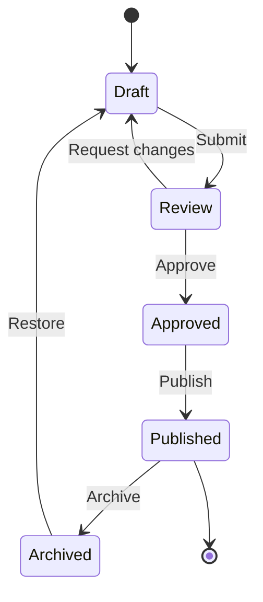
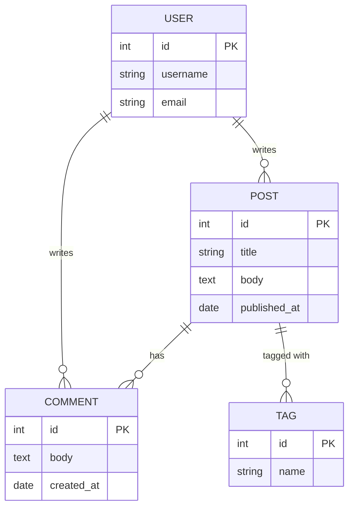
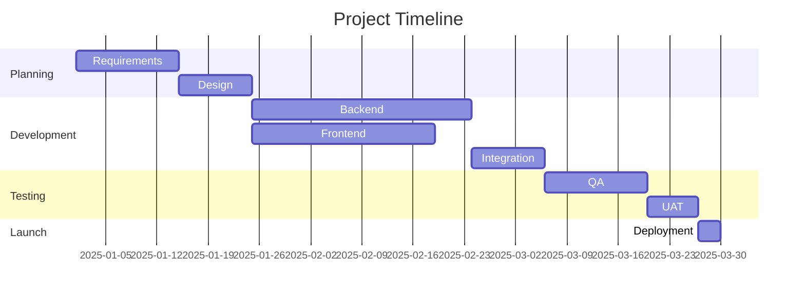
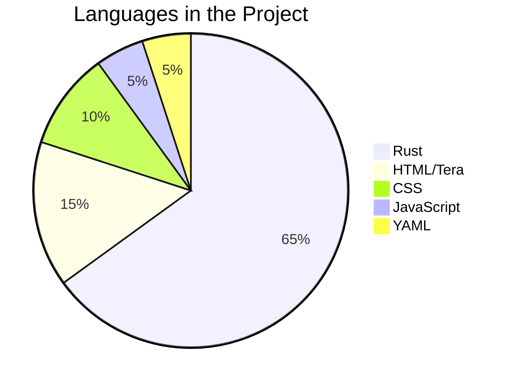
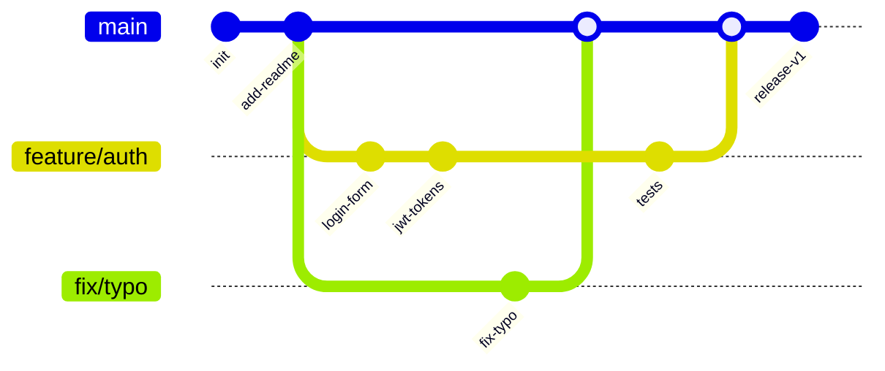
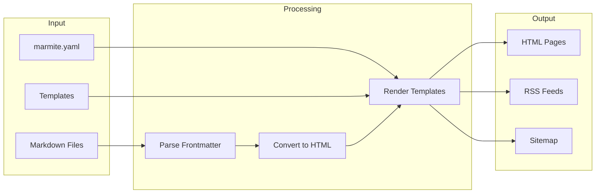
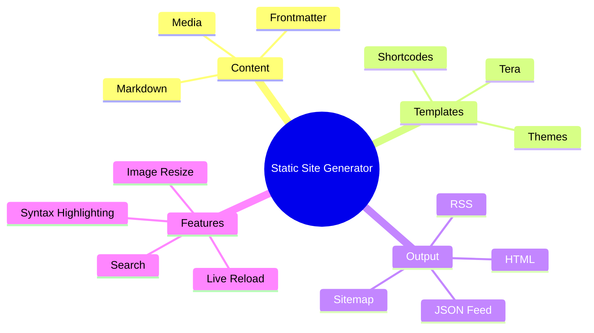

This page tests various mermaid diagram types with native rendering.

## Flowchart



Source:

````

````

---

## Sequence Diagram



Source:

````

````

---

## Class Diagram



Source:

````

````

---

## State Diagram



Source:

````

````

---

## Entity Relationship Diagram



Source:

````

````

---

## Gantt Chart



Source:

````

````

---

## Pie Chart



Source:

````

````

---

## Gitgraph



Source:

````

````

---

## Flowchart with Subgraphs



Source:

````

````

---

## Mindmap



Source:

````

````

---

## Timeline

```mermaid
timeline
    title Marmite Evolution
    2023 : Initial release
         : Basic markdown to HTML
    2024 : Shortcodes support
         : Theme system
         : Image optimization
         : Search integration
    2025 : Native mermaid rendering
         : Workspace multi-site
         : Gallery system
         : ATProto integration
```

Source:

````
```mermaid
timeline
    title Marmite Evolution
    2023 : Initial release
         : Basic markdown to HTML
    2024 : Shortcodes support
         : Theme system
         : Image optimization
         : Search integration
    2025 : Native mermaid rendering
         : Workspace multi-site
         : Gallery system
         : ATProto integration
```
````
