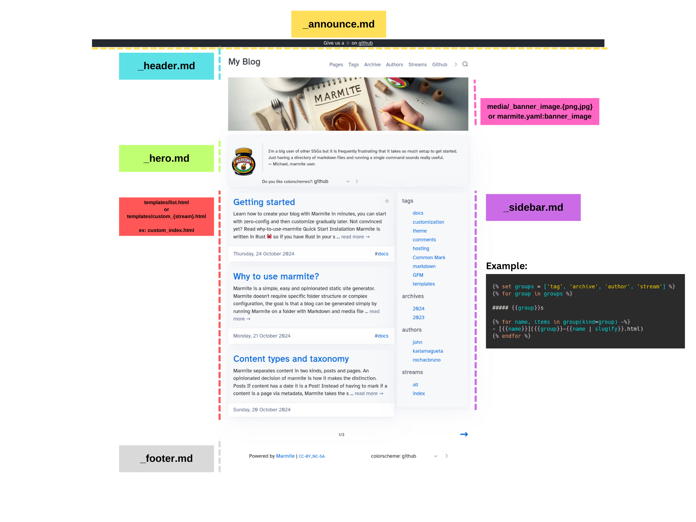
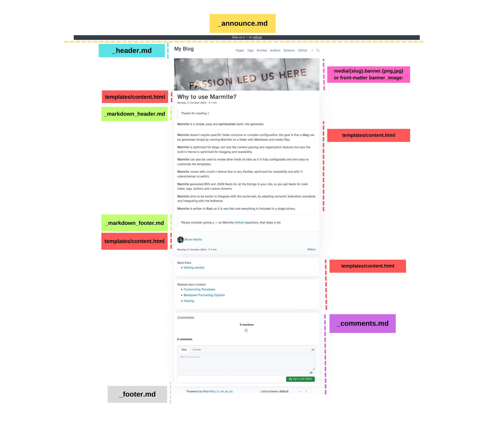

# Using Markdown to customize layout

## Listing Page

The following fragments allow **markdown** and **HTML** and are rendered by **Tera** so it is possible to use template expressions.

The global context is available for templating.

- `_announce.md`
- `_header.md`
- `_hero.md`
- `_sidebar.md`
- `_footer.md`



> The listing itself is only customizable via `templates/list.html` or `templates/custom_{stream}.html`

## Content Page

The following are **static** content **NOT** rendered by template engine so
those allow only raw **HTML** and **markdown**

- `_markdown_header.md`
- `_markdown_footer.md`

The `_comments.md` allows template rendering with global context.

- `_comments.md`




> The Title, Main content, Info and Related content are customizable only via
> `templates/content.html`

## References

- `_references.md`

This is an invisible file that is appended to every other markdown so links
and footnotes are reusable.

`_references.md`
```markdown
[Github]: https://github.com
```

then on any markdown `[Github]` will resolve to the reference link.