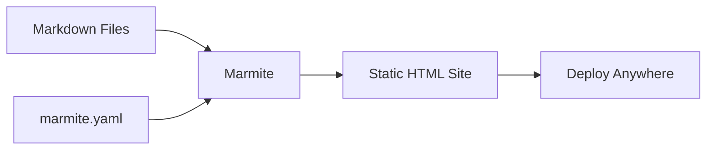
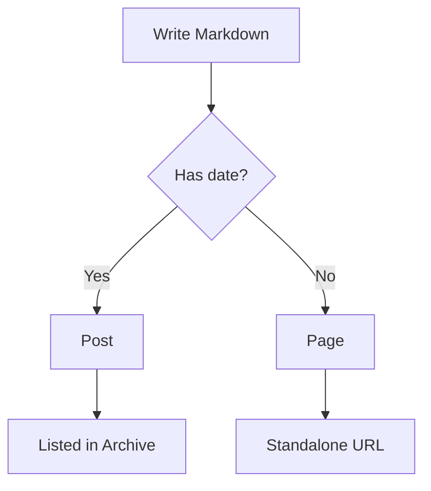

Welcome to the **Marmite Playground** - an interactive environment where you can
learn and experiment with [Marmite](https://marmite.blog), the simplest static
site generator.

## What is Marmite?

**Marmite** (Markdown Makes Sites) takes a folder of Markdown files, combines
them with templates, and produces a complete static website. No JavaScript
frameworks, no complex build pipelines - just Markdown in, HTML out.



## Content Organization

Marmite organizes content into **posts** and **pages**:

- **Posts** have a date in the filename or frontmatter and appear in
  chronological listings (like blog posts)
- **Pages** have no date and are standalone (like "About" or "Contact")

| Type | Example Filename | Appears In |
|------|-----------------|------------|
| Post | `2024-01-01-hello.md` | Home, Archive, Tags |
| Page | `about.md` | Menu (if configured) |

### Frontmatter

Every content file starts with YAML frontmatter between `---` markers:

```yaml
---
title: My Post Title
date: 2024-03-15
tags: rust, tutorial
author: johndoe
---
```

Available frontmatter fields: `title`, `date`, `tags`, `slug`, `author`,
`description`, `banner_image`, `card_image`, `extra`, `stream`, `series`,
`series_order`, `toc`, and more.

## Settings

The `marmite.yaml` file controls your entire site. Open the **marmite.yaml**
tab on the left to see all available options (most are commented out).

Key settings to try:

- `name` / `tagline` - your site's identity
- `menu` - navigation links
- `extra.colorscheme` - visual theme (try `dracula`, `nord`, `gruvbox`)
- `extra.mermaid` - Mermaid diagrams (already enabled here)
- `extra.math` - KaTeX math rendering (already enabled here)
- `pagination` - posts per page

## Using the Playground

1. **Edit** any file using the tabs on the left
2. Click **Render** (or press `Ctrl+Enter`) to build the site
3. **Preview** appears on the right - click links to navigate

Try editing this file and rendering again to see your changes.

## Markdown Features

Marmite supports CommonMark plus many extensions. Here are some to try:

### Text Formatting

You can use **bold**, *italic*, ~~strikethrough~~, __underline__, and
`inline code`. Combine them for ***bold italic***.

### Links and References

- External: [Marmite Documentation](https://marmite.blog)
- Wiki-style: [[about]] links to other content by slug

### Task Lists

- [x] Install Marmite
- [x] Open the Playground
- [ ] Build your first site
- [ ] Deploy it

### Alerts

> [!TIP]
> Marmite supports GitHub-style alerts. Try NOTE, WARNING, IMPORTANT, and
> CAUTION too.

> [!NOTE]
> Edit `marmite.yaml` to change colors. Set `extra.colorscheme: dracula`
> for a dark theme.

### Math with KaTeX

Inline math: The quadratic formula is $x = \frac{-b \pm \sqrt{b^2 - 4ac}}{2a}$.

Block math:

$$
\sum_{n=1}^{\infty} \frac{1}{n^2} = \frac{\pi^2}{6}
$$

### Mermaid Diagrams



### Code Blocks

Marmite highlights code at build time - no JavaScript needed:

```rust
fn main() {
    println!("Hello from Marmite!");
}
```

```python
# Marmite is also available via pip
# pip install marmite
import subprocess
subprocess.run(["marmite", "content/", "site/"])
```

### Footnotes

Marmite is built with Rust[^1] and uses Comrak[^2] for Markdown parsing.

[^1]: Rust is a systems programming language focused on safety and performance.
[^2]: Comrak is a CommonMark + GFM compatible Markdown parser.

### Spoilers

This contains a ||hidden spoiler text|| that is revealed on hover.

### Description Lists

Marmite
: A static site generator written in Rust

Markdown
: A lightweight markup language for creating formatted text

## What's Next?

- Explore all the settings in `marmite.yaml`
- Create new posts by adding `.md` files with dates
- Try different colorschemes
- Read the full docs at [marmite.blog](https://marmite.blog)
